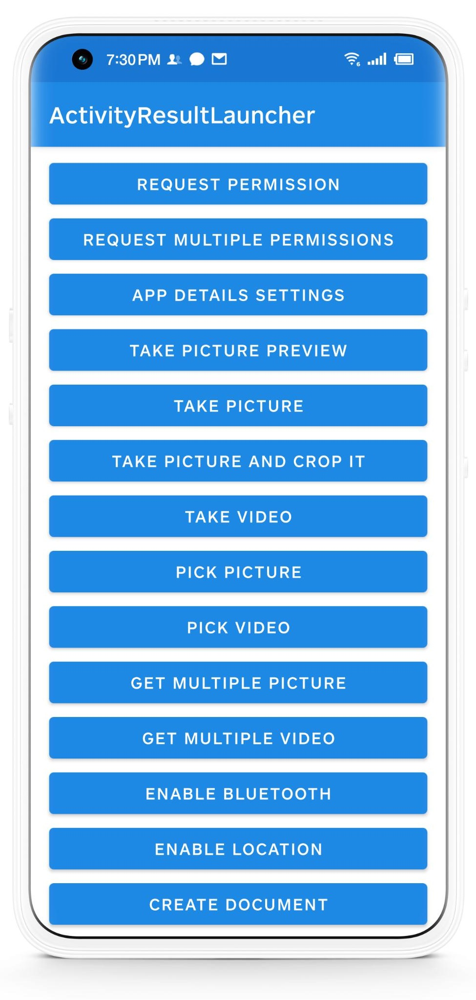

# ActivityResultLauncher

[English](https://github.com/DylanCaiCoding/ActivityResultLauncher) | 中文

[](https://www.jitpack.io/#DylanCaiCoding/ActivityResultLauncher) [](https://github.com/DylanCaiCoding/ActivityResultLauncher/blob/master/LICENSE)

[Activity Result API](https://developer.android.com/training/basics/intents/result) 是官方用于替代 `startActivityForResult()` 和 `onActivityResult()` 的工具。但是 API 用起来并不是很友好，**所以本库能帮助你在尽可能多的场景用更简洁易用的代码来使用 Activity Result API，并且支持对项目用到 startActivityForResult() 的功能进行封装使用**。

## Feature

- 完美地替代 `startActivityForResult()`
- 支持 Kotlin 和 Java 用法
- 支持协程用法
- 支持拍照（已适配 Android 10）
- 支持录像（已适配 Android 10）
- 支持选择图片或视频
- 支持裁剪图片（已适配 Android11）
- 支持请求权限
- 支持打开蓝牙
- 支持打开定位
- 支持使用存储访问框架 SAF
- 支持选择联系人

## Demo



点击或者扫描二维码下载

[](https://www.pgyer.com/activityresultlauncher)


## Gradle

在根目录的 build.gradle 添加：

```groovy
allprojects {
    repositories {
        // ...
        maven { url 'https://www.jitpack.io' }
    }
}
```

添加依赖：

```groovy
dependencies {
    implementation 'com.github.DylanCaiCoding:ActivityResultLauncher:1.1.0'
}
```

## Wiki

#### Kotlin 用法

- [基础用法](https://github.com/DylanCaiCoding/ActivityResultLauncher/wiki/基础用法-(Kotlin))

- [协程用法](https://github.com/DylanCaiCoding/ActivityResultLauncher/wiki/协程用法)

- [自定义启动器](https://github.com/DylanCaiCoding/ActivityResultLauncher/wiki/自定义启动器-(Kotlin))

#### Java 用法

- [基础用法](https://github.com/DylanCaiCoding/ActivityResultLauncher/wiki/基础用法-(Java))

- [自定义启动器](https://github.com/DylanCaiCoding/ActivityResultLauncher/wiki/自定义启动器-(Java))

#### 其它

- [Q&A](https://github.com/DylanCaiCoding/ActivityResultLauncher/wiki/Q&A)

## 更新日志

[Releases](https://github.com/DylanCaiCoding/ActivityResultLauncher/releases)

## 封装思路

[《优雅地封装 Activity Result API，完美地替代 startActivityForResult()》](https://juejin.cn/post/6987575150283587592)

## 作者其它的库

- [LoadingHelper](https://github.com/DylanCaiCoding/LoadingHelper) —— 深度解耦标题栏或加载中、加载失败、无数据等视图
- [ViewBindingKTX](https://github.com/DylanCaiCoding/ViewBindingKTX) —— 最全面的 ViewBinding 工具

## License

```
Copyright (C) 2021. Dylan Cai

Licensed under the Apache License, Version 2.0 (the "License");
you may not use this file except in compliance with the License.
You may obtain a copy of the License at

   http://www.apache.org/licenses/LICENSE-2.0

Unless required by applicable law or agreed to in writing, software
distributed under the License is distributed on an "AS IS" BASIS,
WITHOUT WARRANTIES OR CONDITIONS OF ANY KIND, either express or implied.
See the License for the specific language governing permissions and
limitations under the License.
```
